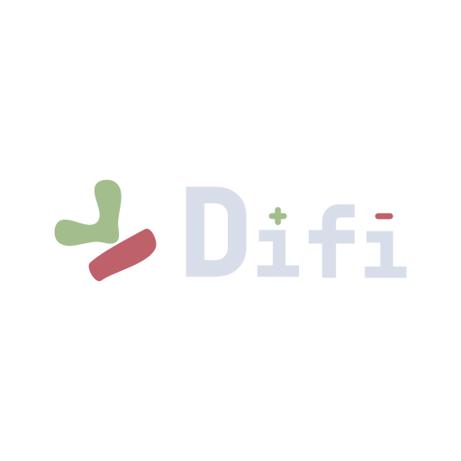
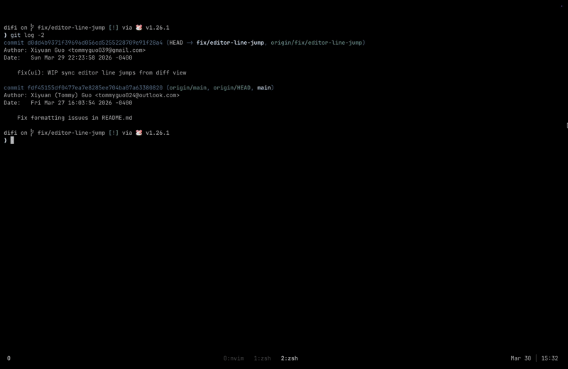

<p align="center">
  
</p>

<p align="center">
  <b>Review and refine Git diffs before you push.</b>
</p>

<p align="center">
  <a href="https://difi.vercel.app/">
    
  </a>
  
  
  
</p>

<p align="center">
    
</p>


## Installation

#### Homebrew (macOS & Linux)

```bash
brew install difi
```

#### Go Install

```bash
go install github.com/xguot/difi/cmd/difi@latest
```

#### AUR (Arch Linux)

**Binary (pre-built):**

```bash
pikaur -S difi-bin
```

**Build from source:**

```bash
pikaur -S difi
```

#### Manual (Linux / Windows)

- Download the binary from Releases and add it to your `$PATH`.

## Workflow

Run difi in any Git repository against main:

```bash
cd my-project
difi
```

To compare against a specific branch or commit, just pass it as an argument:

```bash
# Compare against the main branch
difi main

# Compare against the previous commit
difi HEAD~1
```

## Piping & Alternative VCS

You can also pass raw diffs directly into `difi` via standard input. This is perfect for patch files or other version control systems like Jujutsu:

```bash
# Review a saved patch file
difi < changes.patch

# Review changes in Jujutsu (jj)
jj diff --git | difi

# Pipe standard git diff output
git diff | difi
```

## Controls

| Key           | Action                                       |
| ------------- | -------------------------------------------- |
| `Tab`         | Toggle focus between File Tree and Diff View |
| `j / k`       | Move cursor down / up                        |
| `h / l`       | Focus Left (Tree) / Focus Right (Diff)       |
| `e` / `Enter` | Edit file (opens editor at selected line)    |
| `:`           | Open vim-style command line                  |
| `?`           | Toggle help drawer                           |
| `q` / `ZZ`    | Quit                                         |

## Configuration

`difi` can be configured using a YAML file located at `~/.config/difi/config.yaml`. If the file doesn't exist, `difi` will use sensible defaults.

### Example `config.yaml`

```yaml
editor: "nvim"

ui:
  line_numbers: "hybrid"
  theme: "nord"
  diff_add_bg: "#2b3328" # Optional: Custom background for added lines
  diff_del_bg: "#4a2323" # Optional: Custom background for deleted lines
```

### Options

| Key               | Default                                       | Description                                              |
| :---------------- | :-------------------------------------------- | :------------------------------------------------------- |
| `editor`          | `$DIFI_EDITOR`, `$EDITOR`, `$VISUAL`, or `vi` | The editor to open when pressing `e` on a file.          |
| `ui.line_numbers` | `"hybrid"`                                    | The style of line numbers in the diff view.              |
| `ui.theme`        | `"nord"`                                      | The vim colorscheme used for syntax highlighting and UI. |
| `ui.diff_add_bg`  | `""`                                          | Hex code or terminal color for added line backgrounds.   |
| `ui.diff_del_bg`  | `""`                                          | Hex code or terminal color for deleted line backgrounds. |

## Command Line

Press `:` to open a vim-style command line at the bottom of the screen. Available commands:

| Command                    | Action                                      |
| -------------------------- | ------------------------------------------- |
| `:colorscheme <name>`      | Switch to a different theme                 |
| `:theme <name>`            | Alias for `:colorscheme`                    |
| `:q`, `:quit`              | Exit (same as pressing `q` in normal mode)  |

Tab cycles through matching commands and theme names. Press `Esc` to cancel.

### Available Themes

| Theme               | Description        |
| ------------------- | ------------------ |
| `nord` *(default)*  | Nord dark          |
| `gruvbox`           | Gruvbox dark       |
| `catppuccin-mocha`  | Catppuccin Mocha   |
| `catppuccin-latte`  | Catppuccin Latte   |
| `dracula`           | Dracula            |
| `monokai`           | Monokai            |
| `onedark`           | OneDark            |
| `github`            | GitHub Light       |
| `github-dark`       | GitHub Dark        |
| `rose-pine`         | Rosé Pine          |
| `rose-pine-dawn`    | Rosé Pine Dawn     |
| `solarized-dark`    | Solarized Dark     |
| `tokyonight-night`  | Tokyo Night        |
| `tokyonight-storm`  | Tokyo Night Storm  |
| `evergarden`        | Evergarden         |
| `doom-one`          | Doom One           |
| `quiet`             | Quiet (minimal)    |

Set a default theme in `~/.config/difi/config.yaml`:

```yaml
ui:
  theme: "dracula"
```

## Integrations

#### vim-fugitive

- **The "Unix philosophy" approach:** Uses the industry-standard Git wrapper to provide a robust, side-by-side editing experience.
- **Side-by-Side Editing:** Instantly opens a vertical split (:Gvdiffsplit!) against the index.
- **Merge Conflicts:** Automatically detects conflicts and opens a 3-way merge view for resolution.
- **Config**: Add the line below to if using **lazy.nvim**.

```lua
{
  "tpope/vim-fugitive",
  cmd = { "Gvdiffsplit", "Git" }, -- Add this line
}
```

<p align="left"> 
  <a href="https://github.com/tpope/vim-fugitive.git">
    
  </a>
</p>

#### difi.nvim

Get the ultimate review experience with **[difi.nvim](https://github.com/xguot/difi.nvim)**.

- **Auto-Open:** Instantly jumps to the file and line when you press `e` in the CLI.
- **Visual Diff:** Renders diffs inline with familiar green/red highlights—just like reviewing a PR on GitHub.
- **Interactive Review:** Restore a "deleted" line by simply removing the `-` marker. Discard an added line by deleting it entirely.
- **Context Aware:** Automatically syncs with your `difi` session target.

<p align="left">
  <a href="https://github.com/xguot/difi.nvim">
    
  </a>
</p>

## Git Integration

To use `difi` as a native git command (e.g., `git difi`), add it as an alias in your global git config:

```bash
git config --global alias.difi '!difi'
```

Now you can run it directly from git:

```bash
git difi
```

## Contributors

- [Abraham Joy (@abraham-1672)](https://github.com/abraham-1672) - Logo and Wordmark Design

## Star History

<a href="https://star-history.com/#xguot/difi&Date">
    <picture>
      <source media="(prefers-color-scheme: dark)" srcset="https://api.star-history.com/svg?repos=xguot/difi&type=Date&theme=dark" />
      <source media="(prefers-color-scheme: light)" srcset="https://api.star-history.com/svg?repos=xguot/difi&type=Date" />
      
    </picture>
  </a>
</div>
